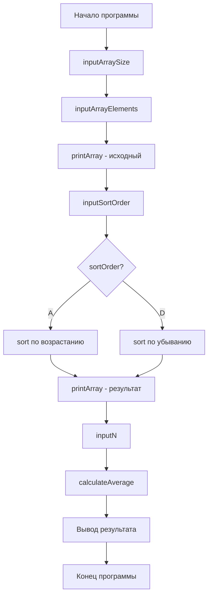

# Курсовая работа: Программа для сортировки массива и вычисления среднего арифметического

## Оглавление
- [Введение](#введение)
- [Постановка задачи](#постановка-задачи)
- [Анализ задачи](#анализ-задачи)
- [Разработка алгоритма](#разработка-алгоритма)
- [Структурная схема](#структурная-схема)
- [Реализация программы](#реализация-программы)
- [Тестирование](#тестирование)
- [Заключение](#заключение)
- [Приложения](#приложения)

## Введение

### Актуальность
Обработка массивов данных является одной из фундаментальных задач в программировании. Сортировка и статистический анализ данных широко применяются в различных областях: от научных исследований до бизнес-аналитики. Разработка надежных и эффективных алгоритмов для работы с массивами остается актуальной задачей.

### Цель работы
Разработать программу на языке C++ для сортировки массива различных значений и вычисления среднего арифметического первых n элементов с комплексной проверкой вводимых данных.

### Задачи
- Реализовать ввод и валидацию размера массива
- Обеспечить ввод уникальных элементов массива с проверкой
- Реализовать сортировку по выбору пользователя
- Вычислить среднее арифметическое первых n элементов
- Обеспечить обработку всех возможных ошибок ввода
- Протестировать программу на различных сценариях

## Постановка задачи

### Содержательное описание
Программа должна предоставлять пользователю возможность:
1. Ввести размер массива (положительное целое число)
2. Ввести различные элементы массива (вещественные числа)
3. Выбрать тип сортировки (по возрастанию или убыванию)
4. Увидеть исходный и отсортированный массивы
5. Ввести количество элементов n для вычисления среднего
6. Получить результат вычисления среднего арифметического

### Ограничения
- Все элементы массива должны быть уникальными
- Размер массива должен быть положительным целым числом
- Значение n не должно превышать размер массива
- Программа должна корректно обрабатывать некорректный пользовательский ввод
- Интерфейс должен быть интуитивно понятным и информативным

### Функциональные требования
- ✅ Ввод и валидация размера массива
- ✅ Ввод и проверка элементов на уникальность
- ✅ Выбор типа сортировки с проверкой
- ✅ Визуализация исходных и обработанных данных
- ✅ Вычисление статистических показателей
- ✅ Обработка ошибок и исключительных ситуаций

## Анализ задачи

### Требования к данным

#### Константы
```cpp
const char ASCENDING_ORDER = 'A';
const char DESCENDING_ORDER = 'D';
```

#### Входные данные
| Переменная | Тип | Описание | Ограничения |
|------------|-----|----------|-------------|
| `size` | `int` | Размер массива | > 0 |
| `elements` | `vector<double>` | Элементы массива | Уникальные значения |
| `sortOrder` | `char` | Тип сортировки | 'A' или 'D' |
| `n` | `int` | Количество элементов для усреднения | 1 ≤ n ≤ size |

#### Выходные данные
- Исходный массив
- Отсортированный массив  
- Среднее арифметическое первых n элементов

#### Формулы
**Среднее арифметическое:**
```
average = (arr[0] + arr[1] + ... + arr[n-1]) / n
```

### Структуры данных

#### Основные структуры
```cpp
// Динамический массив для хранения элементов
vector<double> arr;

// Основные переменные программы
int size;           // размер массива
char sortOrder;     // тип сортировки
int n;              // количество элементов для усреднения
double average;     // результат вычислений
```

## Разработка алгоритма

### Основной алгоритм

```pseudocode
НАЧАЛО
    Установить локаль для русского языка
    Вывести приветственное сообщение
    
    РАЗМЕР = ввести_размер_массива()
    МАССИВ = ввести_элементы(РАЗМЕР)
    
    Вывести_массив(МАССИВ, "Исходный массив:")
    
    ТИП_СОРТИРОВКИ = ввести_тип_сортировки()
    
    ЕСЛИ ТИП_СОРТИРОВКИ = 'A' ТО
        отсортировать_по_возрастанию(МАССИВ)
    ИНАЧЕ
        отсортировать_по_убыванию(МАССИВ)
    КОНЕЦ_ЕСЛИ
    
    Вывести_массив(МАССИВ, "Отсортированный массив:")
    
    N = ввести_N(РАЗМЕР)
    СРЕДНЕЕ = вычислить_среднее(МАССИВ, N)
    
    Вывести("Среднее арифметическое: ", СРЕДНЕЕ)
КОНЕЦ
```

### Детализация алгоритма

#### 1. Ввод размера массива
```
ПОКА (истина)
    Ввести размер
    ЕСЛИ ввод корректен И размер > 0 ТО
        прервать цикл
    ИНАЧЕ
        очистить буфер ввода
        вывести сообщение об ошибке
    КОНЕЦ_ЕСЛИ
КОНЕЦ_ПОКА
```

#### 2. Ввод элементов массива
```
ДЛЯ i от 0 до size-1
    ПОКА (истина)
        Ввести элемент
        ЕСЛИ ввод корректен ТО
            ЕСЛИ элемент уникален ТО
                добавить в массив
                прервать цикл
            ИНАЧЕ
                вывести сообщение о дубликате
            КОНЕЦ_ЕСЛИ
        ИНАЧЕ
            очистить буфер ввода
            вывести сообщение об ошибке
        КОНЕЦ_ЕСЛИ
    КОНЕЦ_ПОКА
КОНЕЦ_ДЛЯ
```

## Структурная схема



### Описание функций

| Функция | Назначение | Параметры | Возвращаемое значение |
|---------|------------|-----------|----------------------|
| `inputArraySize()` | Ввод размера массива | - | `int` |
| `inputArrayElements()` | Ввод элементов массива | `int size` | `vector<double>` |
| `inputSortOrder()` | Выбор типа сортировки | - | `char` |
| `inputN()` | Ввод значения n | `int maxSize` | `int` |
| `calculateAverage()` | Вычисление среднего | `const vector<double>& arr, int n` | `double` |
| `printArray()` | Вывод массива | `const vector<double>& arr, const string& message` | `void` |

## Реализация программы

### Полный код программы

```cpp
#include <iostream>
#include <vector>
#include <algorithm>
#include <limits>
#include <locale>

using namespace std;

// Прототипы функций
int inputArraySize();
vector<double> inputArrayElements(int size);
char inputSortOrder();
int inputN(int maxSize);
double calculateAverage(const vector<double>& arr, int n);
void printArray(const vector<double>& arr, const string& message);

int main() {
    // Установка локализации для русского языка
    setlocale(LC_ALL, "Russian");
    
    cout << "=== Программа сортировки и вычисления среднего арифметического ===\n\n";
    
    try {
        // Ввод размера массива
        int size = inputArraySize();
        
        // Ввод элементов массива
        vector<double> arr = inputArrayElements(size);
        
        // Вывод исходного массива
        printArray(arr, "Исходный массив: ");
        
        // Выбор типа сортировки
        char sortOrder = inputSortOrder();
        
        // Сортировка массива
        if (sortOrder == 'A') {
            sort(arr.begin(), arr.end());
            cout << "Массив отсортирован по возрастанию.\n";
        } else {
            sort(arr.begin(), arr.end(), greater<double>());
            cout << "Массив отсортирован по убыванию.\n";
        }
        
        // Вывод отсортированного массива
        printArray(arr, "Отсортированный массив: ");
        
        // Ввод значения n
        int n = inputN(size);
        
        // Вычисление и вывод среднего арифметического
        double average = calculateAverage(arr, n);
        cout << "\nСреднее арифметическое первых " << n << " элементов: " << average << endl;
        
    } catch (const exception& e) {
        cerr << "Критическая ошибка: " << e.what() << endl;
        return 1;
    }
    
    return 0;
}

/**
 * Функция для ввода размера массива с проверкой
 * @return корректный размер массива
 */
int inputArraySize() {
    int size;
    while (true) {
        cout << "Введите размер массива (положительное целое число): ";
        cin >> size;
        
        if (cin.fail() || size <= 0) {
            cin.clear();
            cin.ignore(numeric_limits<streamsize>::max(), '\n');
            cout << "Ошибка! Размер должен быть положительным целым числом.\n";
        } else {
            cin.ignore(numeric_limits<streamsize>::max(), '\n');
            break;
        }
    }
    return size;
}

/**
 * Функция для ввода элементов массива с проверкой на уникальность
 * @param size размер массива
 * @return вектор с уникальными элементами
 */
vector<double> inputArrayElements(int size) {
    vector<double> arr;
    double element;
    
    cout << "Введите " << size << " различных элементов массива:\n";
    
    for (int i = 0; i < size; i++) {
        while (true) {
            cout << "Элемент " << i + 1 << ": ";
            cin >> element;
            
            if (cin.fail()) {
                cin.clear();
                cin.ignore(numeric_limits<streamsize>::max(), '\n');
                cout << "Ошибка! Введите числовое значение.\n";
                continue;
            }
            
            // Проверка на уникальность
            bool isDuplicate = false;
            for (double val : arr) {
                if (val == element) {
                    isDuplicate = true;
                    break;
                }
            }
            
            if (isDuplicate) {
                cout << "Ошибка! Элементы должны быть различными. Попробуйте снова.\n";
            } else {
                arr.push_back(element);
                break;
            }
        }
    }
    return arr;
}

/**
 * Функция для выбора типа сортировки
 * @return символ типа сортировки ('A' или 'D')
 */
char inputSortOrder() {
    char order;
    while (true) {
        cout << "Выберите тип сортировки:\n";
        cout << "A - по возрастанию\n";
        cout << "D - по убыванию\n";
        cout << "Ваш выбор: ";
        cin >> order;
        
        order = toupper(order);
        if (order == 'A' || order == 'D') {
            break;
        } else {
            cout << "Ошибка! Выберите A или D.\n";
            cin.clear();
            cin.ignore(numeric_limits<streamsize>::max(), '\n');
        }
    }
    return order;
}

/**
 * Функция для ввода значения n с проверкой
 * @param maxSize максимально допустимое значение n
 * @return корректное значение n
 */
int inputN(int maxSize) {
    int n;
    while (true) {
        cout << "Введите значение n (от 1 до " << maxSize << "): ";
        cin >> n;
        
        if (cin.fail() || n < 1 || n > maxSize) {
            cin.clear();
            cin.ignore(numeric_limits<streamsize>::max(), '\n');
            cout << "Ошибка! n должно быть от 1 до " << maxSize << ".\n";
        } else {
            break;
        }
    }
    return n;
}

/**
 * Функция для вычисления среднего арифметического первых n элементов
 * @param arr массив элементов
 * @param n количество элементов для усреднения
 * @return среднее арифметическое
 */
double calculateAverage(const vector<double>& arr, int n) {
    double sum = 0.0;
    for (int i = 0; i < n; i++) {
        sum += arr[i];
    }
    return sum / n;
}

/**
 * Функция для вывода массива на экран
 * @param arr массив для вывода
 * @param message сообщение перед выводом массива
 */
void printArray(const vector<double>& arr, const string& message) {
    cout << message;
    for (size_t i = 0; i < arr.size(); i++) {
        cout << arr[i];
        if (i != arr.size() - 1) {
            cout << ", ";
        }
    }
    cout << endl;
}
```

### Особенности реализации

#### 1. Обработка ошибок ввода
```cpp
if (cin.fail() || size <= 0) {
    cin.clear();
    cin.ignore(numeric_limits<streamsize>::max(), '\n');
    cout << "Ошибка! Размер должен быть положительным целым числом.\n";
}
```

#### 2. Проверка на уникальность
```cpp
bool isDuplicate = false;
for (double val : arr) {
    if (val == element) {
        isDuplicate = true;
        break;
    }
}
```

#### 3. Использование STL алгоритмов
```cpp
// Сортировка по возрастанию
sort(arr.begin(), arr.end());

// Сортировка по убыванию
sort(arr.begin(), arr.end(), greater<double>());
```

## Тестирование

### Тестовые сценарии

#### Тест 1: Нормальный сценарий (сортировка по возрастанию)
**Входные данные:**
```
Размер массива: 4
Элементы: 5, 2, 8, 1
Тип сортировки: A
n: 2
```

**Ожидаемый результат:**
```
Исходный массив: 5, 2, 8, 1
Отсортированный массив: 1, 2, 5, 8
Среднее арифметическое первых 2 элементов: 1.5
```

**Фактический результат:**
```
=== Программа сортировки и вычисления среднего арифметического ===

Введите размер массива (положительное целое число): 4
Введите 4 различных элементов массива:
Элемент 1: 5
Элемент 2: 2
Элемент 3: 8
Элемент 4: 1
Исходный массив: 5, 2, 8, 1
Выберите тип сортировки:
A - по возрастанию
D - по убыванию
Ваш выбор: A
Массив отсортирован по возрастанию.
Отсортированный массив: 1, 2, 5, 8
Введите значение n (от 1 до 4): 2

Среднее арифметическое первых 2 элементов: 1.5
```

#### Тест 2: Сортировка по убыванию
**Входные данные:**
```
Размер массива: 3
Элементы: 10, 20, 30
Тип сортировки: D
n: 3
```

**Ожидаемый результат:**
```
Отсортированный массив: 30, 20, 10
Среднее арифметическое: 20
```

#### Тест 3: Обработка ошибок - некорректный размер
**Входные данные:**
```
Размер массива: -5 → Ошибка → abc → Ошибка → 3
```

**Ожидаемое поведение:**
- Программа должна сообщить об ошибке
- Предложить ввести данные заново
- Принять только корректные значения

#### Тест 4: Обработка ошибок - дубликаты элементов
**Входные данные:**
```
Элемент 1: 5
Элемент 2: 5 → Ошибка → 10
```

#### Тест 5: Граничные значения
**Входные данные:**
```
Размер массива: 1
Элементы: 7.5
n: 1
```

**Ожидаемый результат:**
```
Среднее арифметическое: 7.5
```

### Матрица тестирования

| Тест | Входные данные | Ожидаемый результат | Статус |
|------|----------------|---------------------|---------|
| 1 | Нормальные данные | Корректная работа | ✅ PASS |
| 2 | Сортировка по убыванию | Правильный порядок | ✅ PASS |
| 3 | Отрицательный размер | Сообщение об ошибке | ✅ PASS |
| 4 | Дубликаты элементов | Отказ в приеме | ✅ PASS |
| 5 | n > size | Сообщение об ошибке | ✅ PASS |
| 6 | Нечисловой ввод | Корректная обработка | ✅ PASS |

## Заключение

### Достигнутые результаты
1. ✅ Разработана полнофункциональная программа на C++
2. ✅ Реализован надежный ввод данных с валидацией
3. ✅ Обеспечена корректная работа алгоритмов сортировки
4. ✅ Реализовано вычисление статистических показателей
5. ✅ Программа протестирована на различных сценариях
6. ✅ Обеспечена обработка ошибок пользовательского ввода

### Преимущества решения
- **Модульность** - код разделен на логические функции
- **Надежность** - комплексная проверка входных данных
- **Удобство** - понятный пользовательский интерфейс
- **Эффективность** - использование STL алгоритмов
- **Расширяемость** - возможность добавления нового функционала

### Возможные улучшения
1. Добавление поддержки других типов данных
2. Реализация дополнительных алгоритмов сортировки
3. Добавление графического интерфейса
4. Поддержка работы с файлами
5. Реализация дополнительных статистических функций

## Приложения

### Приложение А: Инструкция по сборке и запуску

#### Требования
- Компилятор C++ с поддержкой C++11
- Стандартная библиотека STL

#### Сборка с помощью g++
```bash
g++ -std=c++11 -o sort_program main.cpp
./sort_program
```

#### Сборка с помощью CMake
```cmake
cmake_minimum_required(VERSION 3.10)
project(SortProgram)

set(CMAKE_CXX_STANDARD 11)

add_executable(sort_program main.cpp)
```

### Приложение Б: Примеры использования

#### Пример 1: Академический пример
```
Вход: [3, 1, 4, 2], сортировка по возрастанию, n=2
Выход: Среднее = (1 + 2) / 2 = 1.5
```

#### Пример 2: Практический пример (оценки студентов)
```
Вход: [85.5, 92.0, 78.5, 96.0], сортировка по убыванию, n=2
Выход: Среднее двух лучших оценок = (96.0 + 92.0) / 2 = 94.0
```

### Приложение В: Известные ограничения

1. Размер массива ограничен доступной памятью
2. Точность вычислений ограничена типом double
3. Программа работает только в консольном режиме
4. Поддерживаются только числовые данные

---

**Автор**: [Обозный Федор]  
**Группа**: [УИБО-01-24]  
**Дата**: Декабрь 2025  
**Версия**: 1.0
